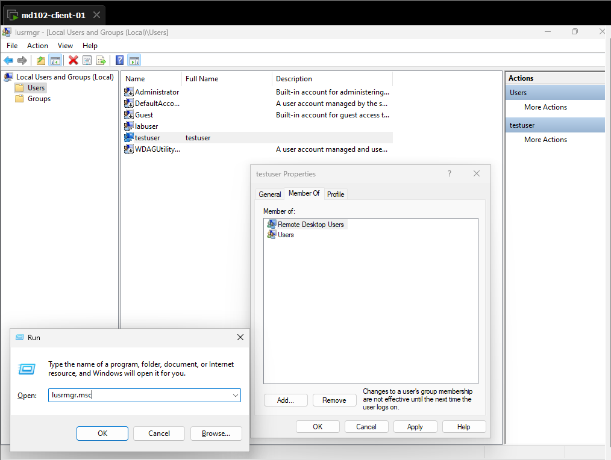
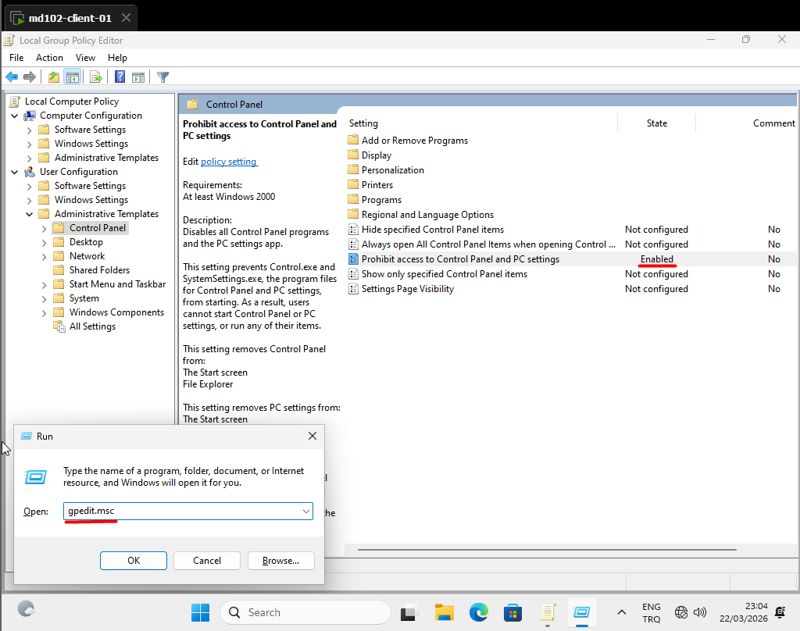

# Lab 02 - Local User and Group Management

## Objective
Manage local users, groups, and basic policies on Windows 11.

## Environment
- Device: md102-client-01
- OS: Windows 11 Pro
- Account: labuser (local admin)

## Tasks
1. Create a new local user
2. Add user to local groups
3. Remove user from group
4. Configure basic local policy

## Steps
1. Opened Run (Win + R) and executed lusrmgr.msc
2. Navigated to Local Users and Groups
3. Created new user (testuser)
4. Added user to "Remote Desktop Users" group
5. Removed user from "Remote Desktop Users" group

6. Executed gpedit.msc to open Local Group Policy Editor
7. Enabled "Prohibit access to Control Panel" policy

## Result
Basic local user and group management completed.

## Notes
These operations simulate device-level management before Intune.
