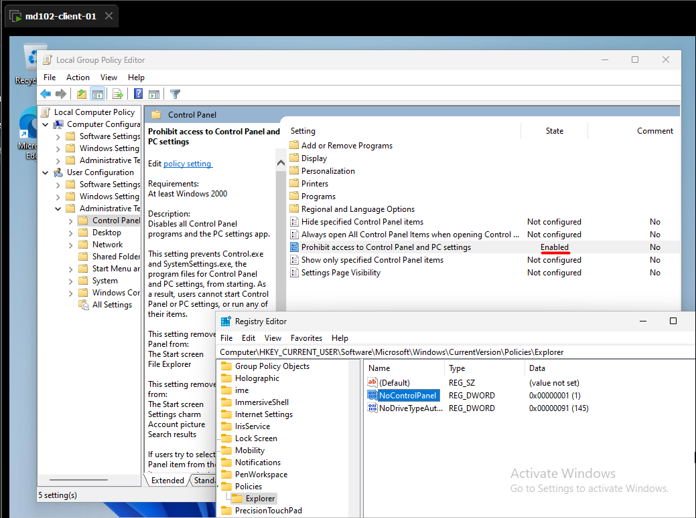
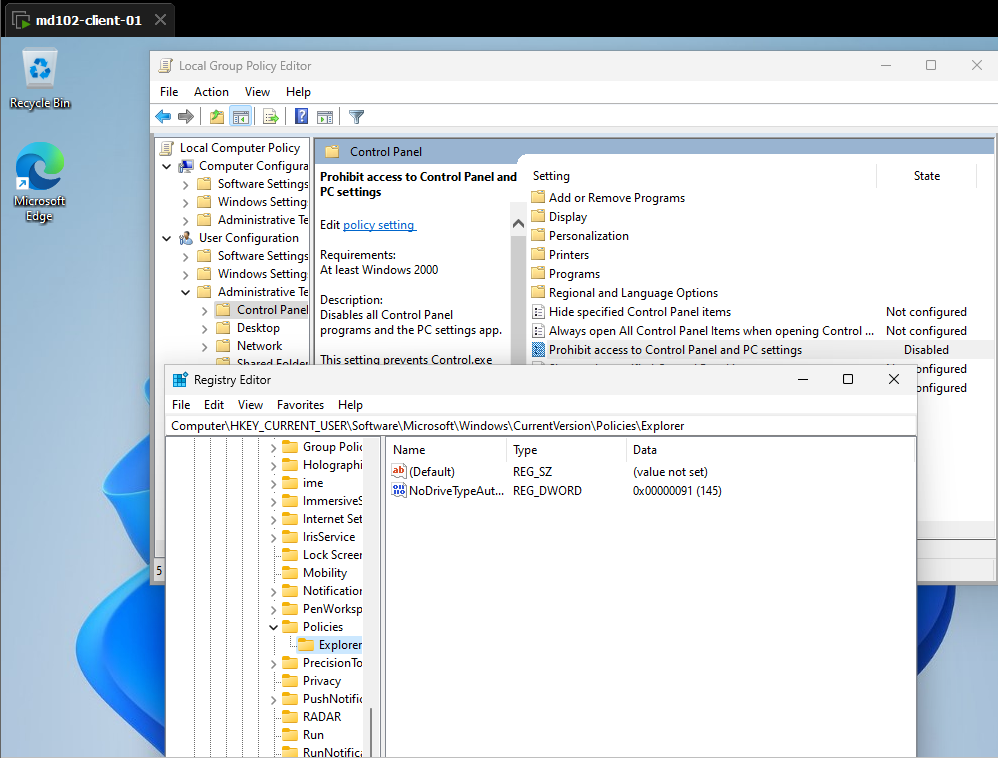

# Lab 03 - Policy and Registry Relationship

## Objective
Understand how local group policies affect the Windows registry and how to verify policy changes.

## Environment
- Device: md102-client-01
- OS: Windows 11 Pro
- Account: labuser (local admin)

## Tasks
1. Apply a local group policy
2. Verify policy effect in registry

## Steps
1. Opened Run (Win + R) and executed gpedit.msc
2. Navigated to:
   User Configuration → Administrative Templates → Control Panel
3. Enabled "Prohibit access to Control Panel" policy

4. Opened Run (Win + R) and executed regedit
5. Navigated to:
   HKEY_CURRENT_USER\Software\Microsoft\Windows\CurrentVersion\Policies\Explorer
6. Verified "NoControlPanel" registry key does not exist

## Result
Policy changes successfully reflected in the registry.

## Notes
Local group policies are enforced through registry values such as "NoControlPanel".
