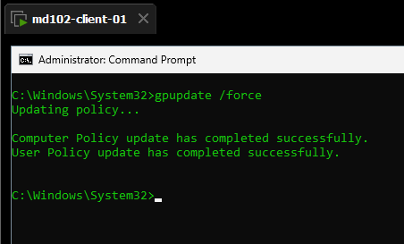
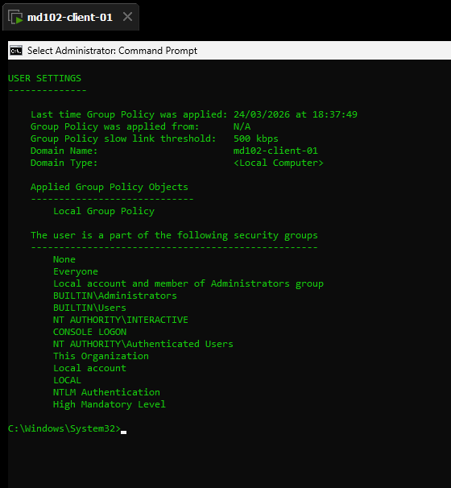

# Lab 04 - Policy Troubleshooting

## Objective
Verify that a local group policy is applied and validate it using command output.

## Environment
- Device: md102-client-01
- OS: Windows 11 Pro
- Account: labuser (local admin)

## Tasks
1. Refresh local group policy
2. Verify applied policy
3. Confirm policy behavior

## Steps
1. Opened Command Prompt as administrator
2. Executed `gpupdate /force`

3. Executed `gpresult /r`
4. Verified applied policies under USER SETTINGS

5. Attempted to open Control Panel
6. Confirmed that access is restricted

## Result
Local group policy was successfully applied and verified using gpupdate and gpresult. Control Panel access was restricted as expected.

## Notes
`gpupdate` refreshes policies, while `gpresult` confirms whether they are applied. Validation should include both command output and actual system behavior.
