# Lab 05 - Device Enrollment Readiness

## Objective

Prepare the Windows 11 device for Microsoft Entra ID join or MDM enrollment by validating identity, system state, network connectivity, and time synchronization.

---

## Environment

- Device: md102-client-01  
- OS: Windows 11 Pro  
- Account: labuser (local admin)  
- Hypervisor: VMware Workstation  
- Network: NAT  

---

## Tasks

- Verify device information  
- Verify local identity  
- Review system configuration  
- Check join status  
- Validate network connectivity  
- Validate time synchronization readiness  

---

## Step 1 - Verify device information

Open:

- Settings → System → About  

Check:
- Device name  
- Windows edition  

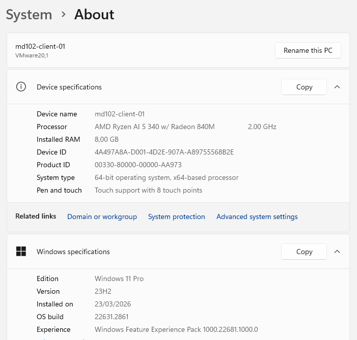

---

## Step 2 - Verify local identity

Run:

```cmd
hostname
whoami
```

Check:
- Hostname is correct  
- User is correct  

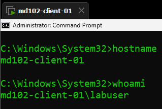

---

## Step 3 - Review system information

Run:

```cmd
systeminfo
```

Check:
- OS version  
- System configuration  

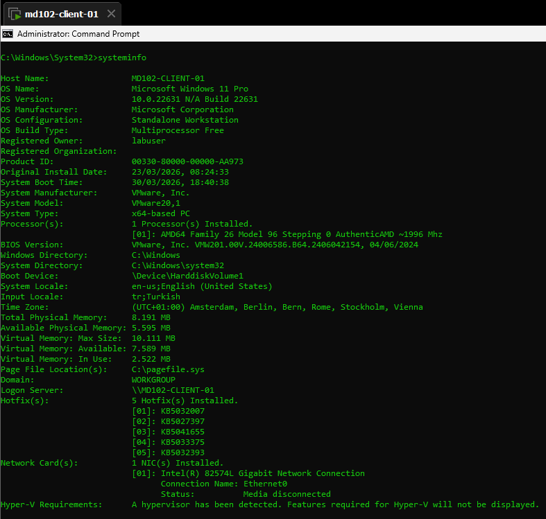

---

## Step 4 - Check join status

Run:

```cmd
dsregcmd /status
```

Check:

- AzureAdJoined  
- DomainJoined  
- WorkplaceJoined  

Expected (clean state):

- NO for all  

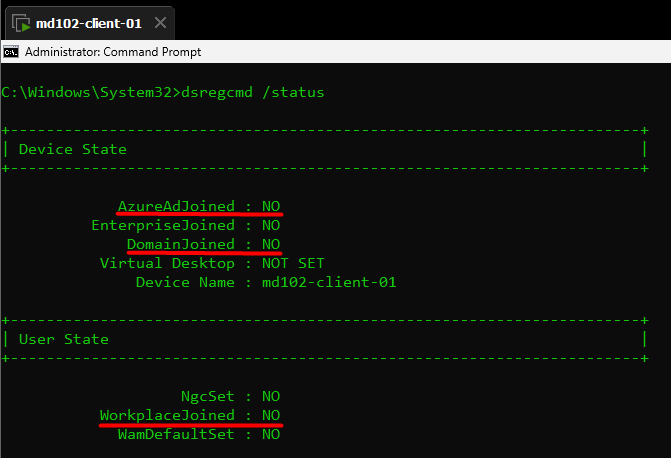

---

## Step 5 - Test network connectivity

Run:

```cmd
ping login.microsoftonline.com
nslookup login.microsoftonline.com
```

Check:

- DNS resolution works  
- Network connectivity available  

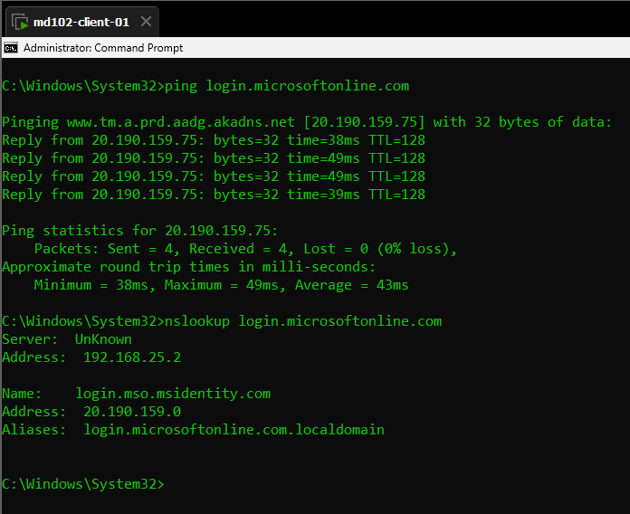

---

## Step 6 - Validate time synchronization

Run:

```cmd
w32tm /query /status
```

Initial result:

- Service not started  

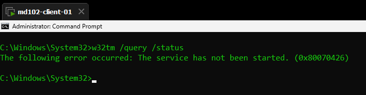

---

## Step 6.1 - Check service state

```cmd
sc query w32time
```

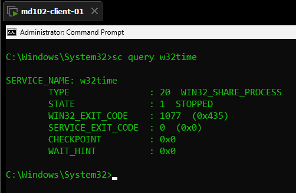

---

## Step 6.2 - Check service configuration

```cmd
sc qc w32time
```

Result:

- Service set to manual  

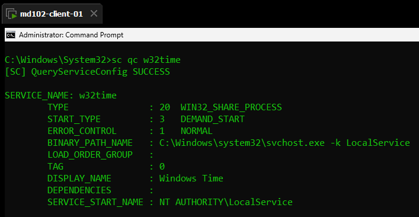

---

## Step 6.3 - Set startup to automatic

```cmd
sc config w32time start= auto
```

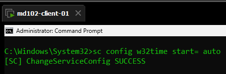

---

## Step 6.4 - Start service

```cmd
net start w32time
```

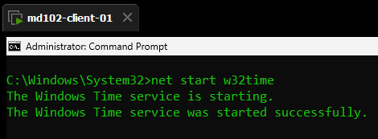

---

## Step 6.5 - Attempt sync

```cmd
w32tm /resync
```

Result:

- No time data available  

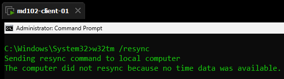

---

## Step 6.6 - Configure NTP

```cmd
w32tm /config /manualpeerlist:"time.windows.com" /syncfromflags:manual /update
```

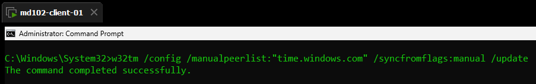

---

## Step 6.7 - Restart service

```cmd
net stop w32time
net start w32time
```

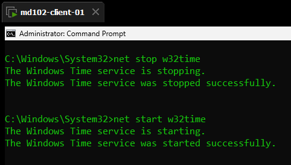

---

## Step 6.8 - Retry sync

```cmd
w32tm /resync
```

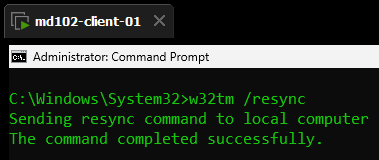

---

## Step 6.9 - Final validation

```cmd
w32tm /query /status
```

Check:

- Source is time.windows.com  
- Sync successful  

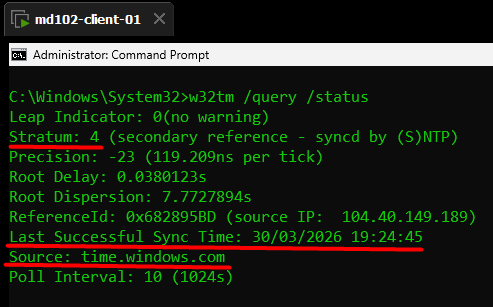

---

## Validation

- Device info correct  
- Identity verified  
- System info consistent  
- Device not joined  
- Network working  
- DNS working  
- Time service running  
- Time synchronized  

---

## Result

The device is validated and ready for Microsoft Entra ID join or MDM enrollment.

---

## Notes

- Time service was not running initially  
- Service was manual  
- No NTP configured  
- Issue fixed and documented  

See: [troubleshoot.md](./troubleshoot.md)
