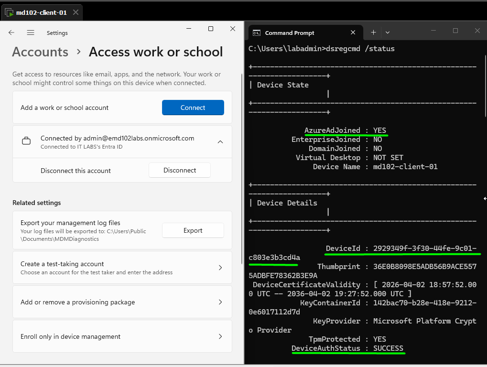
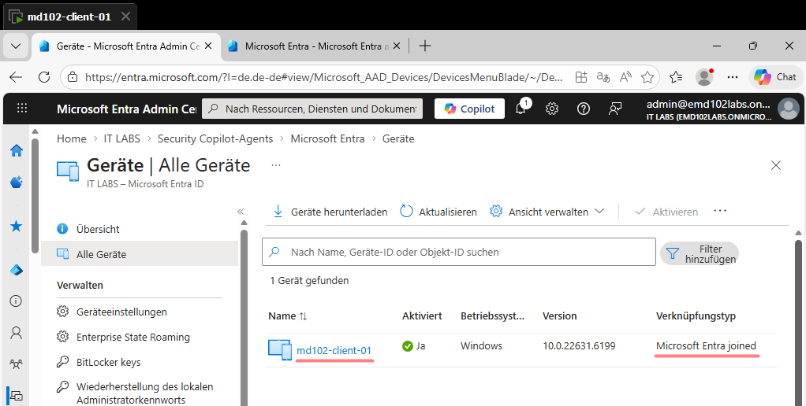

# Lab 06 – Microsoft Entra ID Device Join

## Objective

Join a Windows 11 device to Microsoft Entra ID and validate the join across the local system, Windows Settings, and the Microsoft Entra admin center.

---

## Environment

* Device: md102-client-01
* OS: Windows 11
* Local User: labadmin
* Tenant: emd102labs.onmicrosoft.com
* Account: [admin@emd102labs.onmicrosoft.com](mailto:admin@emd102labs.onmicrosoft.com)

---

## Step 1 – Join Device to Microsoft Entra ID

Navigate to:

Settings → Accounts → Access work or school

Click: Connect

Then select: Join this device to Microsoft Entra ID

---

## Step 2 – Authenticate

Enter:
emd102labs.onmicrosoft.com

Sign in:
[admin@emd102labs.onmicrosoft.com](mailto:admin@emd102labs.onmicrosoft.com)

Complete authentication.

---

## Step 3 – Verify with dsregcmd

Run command:

dsregcmd /status

### Expected Results

* AzureAdJoined : YES
* DeviceAuthStatus : SUCCESS

### Evidence

---

## Step 4 – Verify in Windows Settings

Navigate to:

Settings → Accounts → Access work or school

### Expected Result

Device is connected to IT LABS Entra ID.

---

## Step 5 – Verify in Microsoft Entra Admin Center

Navigate to:

Microsoft Entra Admin Center → Devices → All devices

### Expected Results

* Device name: md102-client-01
* Status: Enabled
* Join type: Microsoft Entra joined

### Evidence

---

## Join Type Analysis

| Join Type      | Description                    | Result    |
| -------------- | ------------------------------ | --------- |
| Azure AD Join  | Full device identity in tenant | Correct   |
| Workplace Join | User-only registration         | Incorrect |

---

## Troubleshooting

### Issues

* Device registered as WorkplaceJoined
* Wrong join flow used
* Microsoft account interference
* Cached identity state

### Root Cause

Incorrect join method caused user-level registration instead of full device join.

### Resolution

Run:

dsregcmd /leave

Then:

* Restart device
* Reconnect using: Join this device to Microsoft Entra ID

---

## Validation Summary

| Check            | Result    |
| ---------------- | --------- |
| AzureAdJoined    | YES       |
| DeviceAuthStatus | SUCCESS   |
| Settings         | Connected |
| Entra Portal     | Visible   |

---

## Result

Device successfully joined to Microsoft Entra ID and validated across all layers.
