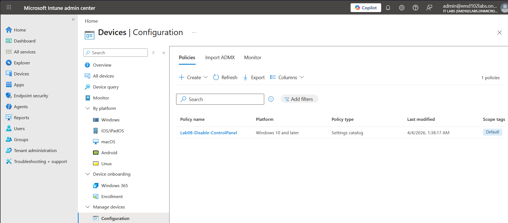
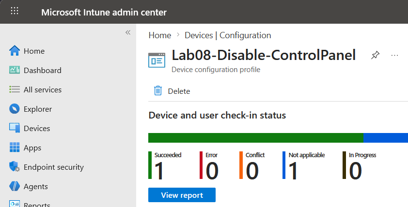
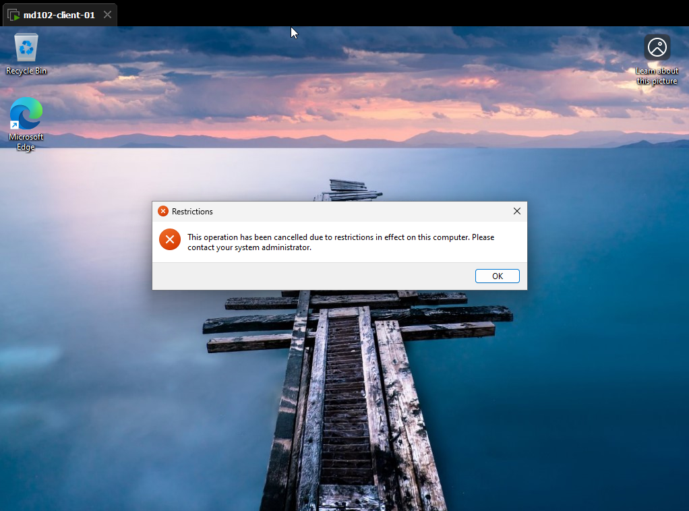

# Lab 08 – Disable Control Panel via Intune

## Objective

Deploy a configuration profile using Microsoft Intune to disable access to Control Panel and verify enforcement on a Windows 11 device.

---

## Environment

* Device: md102-client-01
* OS: Windows 11
* User: [admin@emd102labs.onmicrosoft.com](mailto:admin@emd102labs.onmicrosoft.com)
* Tenant: emd102labs.onmicrosoft.com

---

## Step 1 – Create Configuration Profile

Navigate to:

Devices → Configuration → Create

Settings:

* Platform: Windows 10 and later
* Profile type: Settings 

---

## Step 2 – Configure Policy

Go to:

Administrative Templates → Control Panel

Enable:

* Prohibit access to Control Panel and PC settings (User) → Enabled

---

## Step 3 – Assign Policy

Assign to:

* All devices




---

## Step 4 – Sync Device

On client:

```bash
gpupdate /force
shutdown /r /t 0
```

---

## Step 5 – Verify in Intune

Navigate to:

Devices → Windows devices → TESTLAB → Device configuration

Expected result:

* Policy status → Succeeded



---

## Step 6 – Verify Registry

Run:

```bash
reg query HKCU\Software\Microsoft\Windows\CurrentVersion\Policies\Explorer
```

Expected:

```text
NoControlPanel    REG_DWORD    0x1
```

---

## Step 7 – Validate Enforcement

Test:

```bash
control.exe
```

Expected:

* Access blocked with restriction message



---


## Result

Control Panel access successfully disabled using Intune configuration profile. Policy deployment, registry enforcement, and user-level restriction verified.
