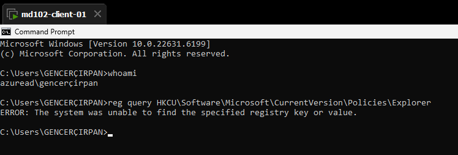

# Lab 08 – Troubleshooting

## Overview

During the deployment of the Intune configuration profile to disable Control Panel, the policy did not initially apply despite being successfully created and assigned.

This section documents the troubleshooting process, findings, and final resolution.

---

## Initial Issue

### Symptoms

* Control Panel remained accessible
* Policy showed inconsistent status
* No restriction applied on the device

---

## Attempt 1 – Verify User Context

### Observation

Initially, the device was used with a **local account (labadmin)**.

### Action

* Logged out
* Signed in with Azure AD user:

```text
admin@emd102labs.onmicrosoft.com
```

### Result

* Device recognized the user correctly
* Issue persisted

---

## Attempt 2 – Verify Policy Assignment

### Observation

* Policy was assigned to **All users**

### Action

* Changed assignment to **All devices**

### Result

* Policy still not applied

---

## Attempt 3 – Verify Policy Configuration

### Observation

* Policy setting was configured incorrectly

### Action

* Corrected setting:

```text
Prohibit access to Control Panel and PC settings → Enabled
```

### Result

* Policy configuration fixed
* Still not enforced

---

## Attempt 4 – Check Registry

### Command

```bash
reg query HKCU\Software\Microsoft\Windows\CurrentVersion\Policies\Explorer
```

### Result

```text
ERROR: The system was unable to find the specified registry key
```



### Analysis

* Policy had **not been applied to user context**
* No enforcement at system level

---

## Attempt 5 – Verify Intune Deployment Status

### Observation

* Policy status in Intune:

```text
Succeeded: 1
```

### Analysis

* Policy was successfully delivered
* Issue was not deployment-related

---

## Root Cause

> The policy was applied but **not enforced due to user session caching**.

* User-based policy (HKCU)
* Session did not refresh after policy delivery

---

## Final Resolution

### Action

Forced policy update and system restart:

```bash
gpupdate /force
shutdown /r /t 0
```

---

## Final Verification

### Registry Check

```bash
reg query HKCU\Software\Microsoft\Windows\CurrentVersion\Policies\Explorer
```

Expected:

```text
NoControlPanel    REG_DWORD    0x1
```

---

### Functional Test

```bash
control.exe
```

Result:

* Control Panel access blocked


---

## Final State

| Component         | Status      |
| ----------------- | ----------- |
| Policy Deployment | ✔ Succeeded |
| Registry Key      | ✔ Present   |
| Enforcement       | ✔ Active    |
