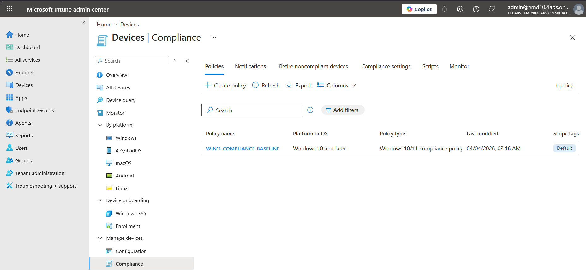

# Lab 09 – Windows 11 Compliance Policy (Intune)

## Objective

Create and validate a compliance policy in Microsoft Intune enforcing:

- BitLocker encryption
- Trusted Platform Module (TPM)
- Secure Boot
- Minimum OS version

Verify device compliance status and ensure successful policy evaluation.

---

## Environment

- Device: md102-client-01
- OS: Windows 11 Enterprise
- Tenant: emd102labs.onmicrosoft.com
- User: admin@emd102labs.onmicrosoft.com
- Platform: Microsoft Intune

---

## Step 1 – Create Compliance Policy

Navigate to:

Devices → Compliance → Policies → Create policy

Settings:

- Platform: Windows 10 and later
- Profile type: Compliance policy

---

## Step 2 – Configure Policy Settings

### Device Health

- BitLocker → Required  
- Secure Boot → Required  

### Device Properties

- Minimum OS version → `10.0.22000`

### System Security

- TPM → Required  

---

## Step 3 – Assign Policy

Assign to:

- All Devices

---

## Step 4 – Sync Device

Trigger a manual sync from Microsoft Intune:

Devices → All devices → Select device → Sync

Additionally, a device restart was initiated to accelerate policy application and ensure all security settings (BitLocker, TPM, Secure Boot) were properly evaluated.

---

## Step 5 – Validation

### Initial State

Device reported as **Compliant**

---
