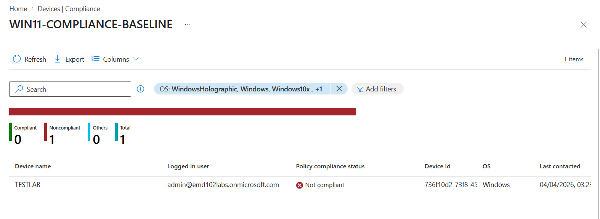
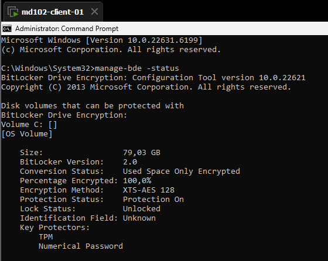
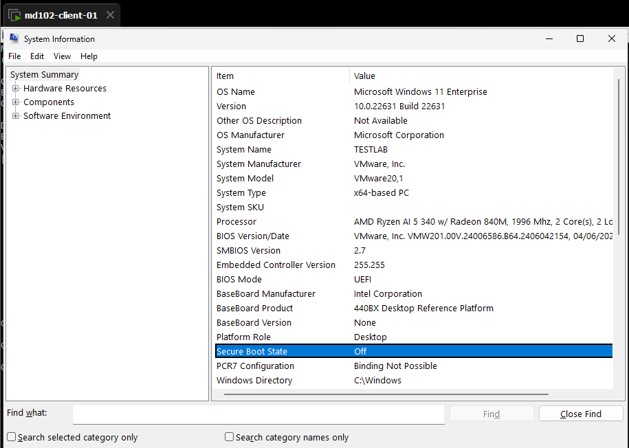
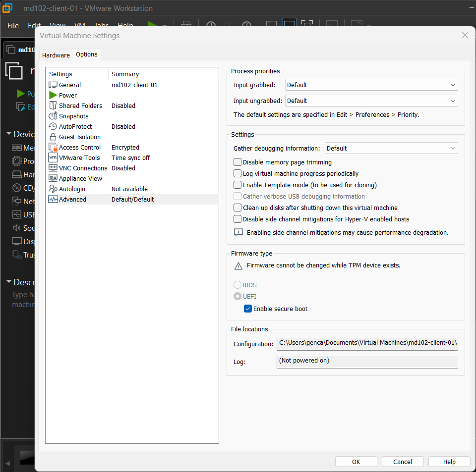
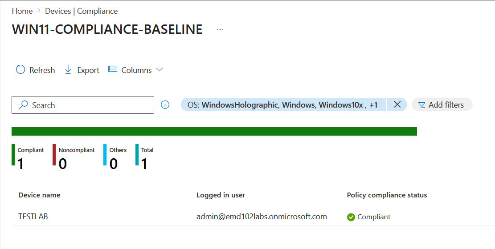

# Lab 09 – Troubleshooting Compliance Policy

## Issue – Device Reported as Noncompliant

### Evidence 1 – Intune Compliance Status

Device initially appeared as **Not compliant** in Microsoft Intune.

---

### Evidence 2 – BitLocker Status Verified

BitLocker was correctly enabled and fully encrypted.

✔ Encryption: 100%  
✔ Protection Status: On  

Conclusion:
BitLocker was NOT the issue.

---

### Evidence 3 – Secure Boot Disabled

System Information showed Secure Boot was OFF.

Conclusion:
This violates compliance policy → root cause candidate.

---

### Root Cause

Secure Boot was disabled at firmware level (VM configuration).

Even though:
- BitLocker = OK  
- TPM = OK  

Device still failed compliance because:
Secure Boot = REQUIRED

---

### Fix – Enable Secure Boot

Secure Boot was enabled via VMware settings:

Steps:
- VM Settings → Options → Advanced  
- Enable Secure Boot  

---

### Remediation Actions

After enabling Secure Boot:

1. Device restarted  
2. Manual sync triggered from Intune  
3. Policy re-evaluated  

---

### Validation – Compliance Achieved

Device status changed to **Compliant**

---

## Final Analysis

Failure was NOT caused by:
- BitLocker
- TPM
- Policy configuration

Failure was caused by:
- Misconfigured VM firmware (Secure Boot disabled)

---

## Key Takeaway

Compliance policies validate **device state**, not just configuration.

Even if encryption is enabled, missing Secure Boot results in noncompliance.
