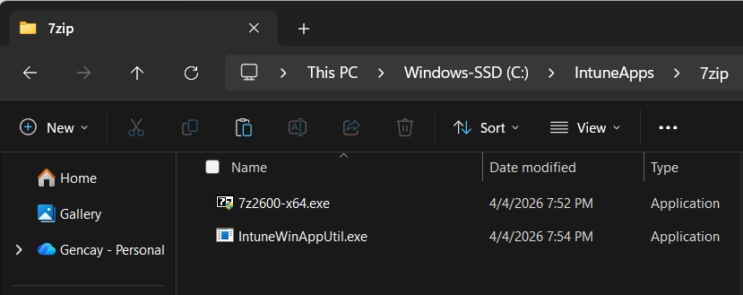
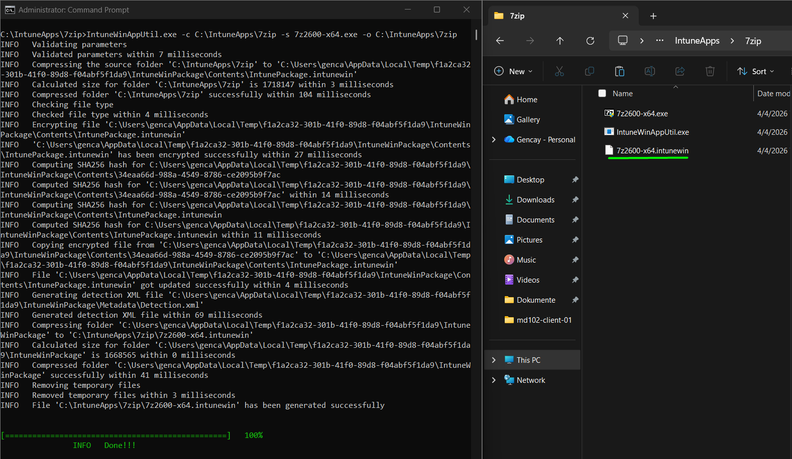
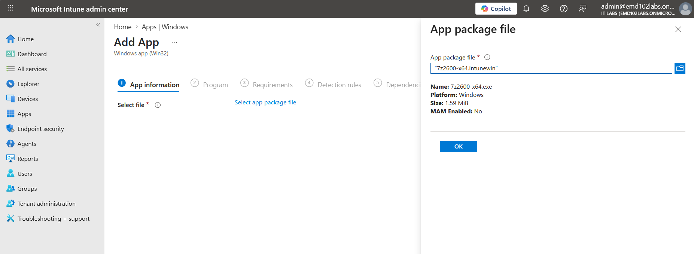
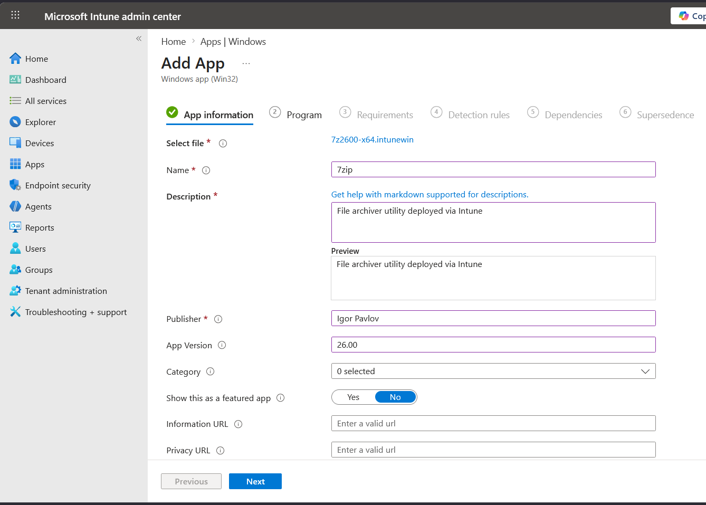
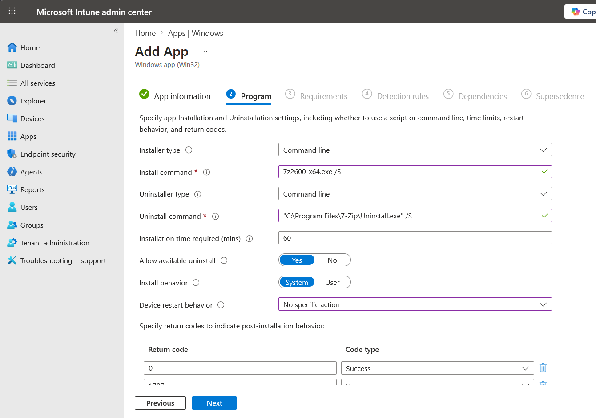
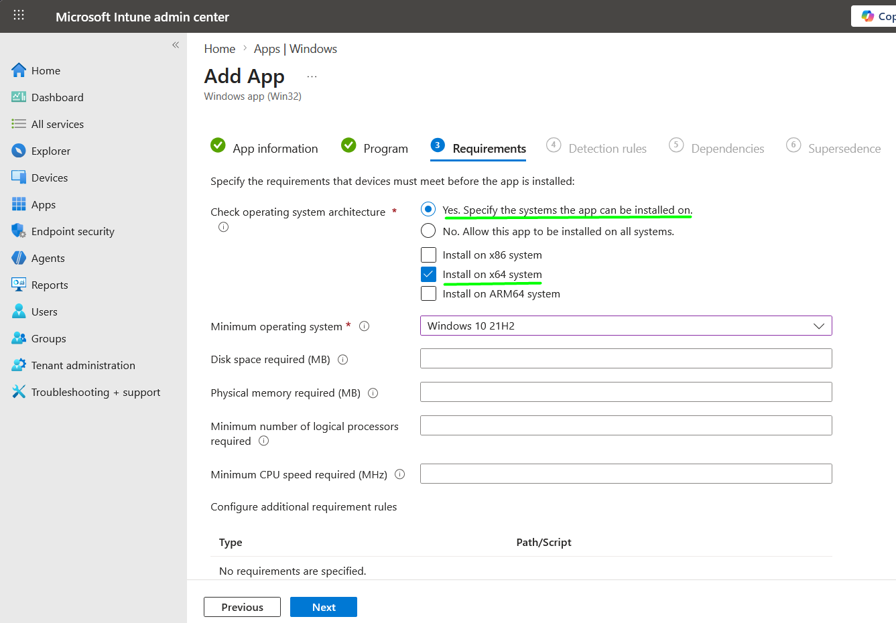
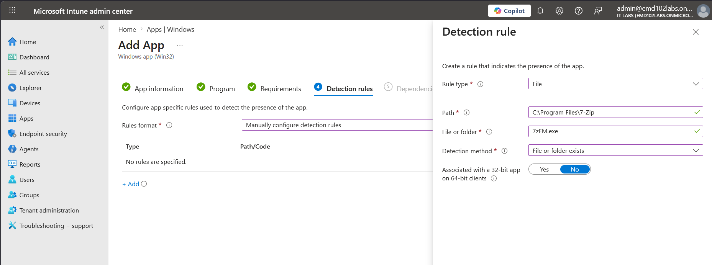
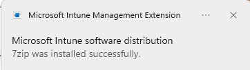
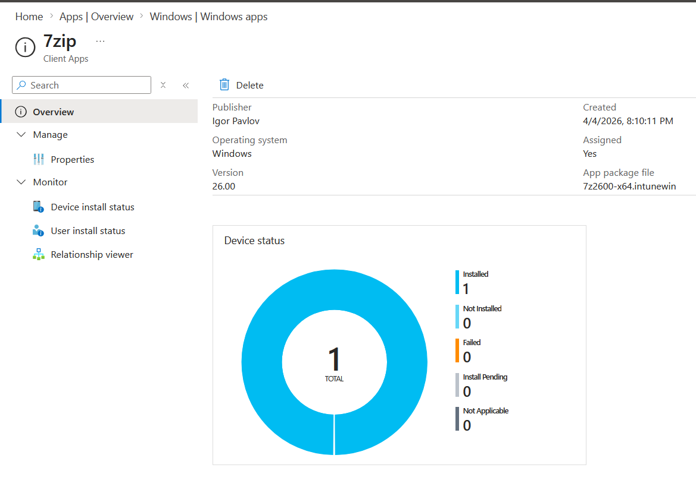

# Lab 10 – Deploy Win32 App (7-Zip) via Microsoft Intune

## Objective

Package a Win32 application using `.intunewin` format and deploy it via Microsoft Intune.
Validate successful installation on a Windows 11 client.

---

## Environment

* Device: md102-client-01
* OS: Windows 11
* Tenant: emd102labs.onmicrosoft.com
* User: [admin@emd102labs.onmicrosoft.com](mailto:admin@emd102labs.onmicrosoft.com)
* Tool: Microsoft Intune

---

## Step 1 – Prepare Application Files

Create a working directory:

```text
C:\IntuneApps\7zip
```

Place inside:

* 7z2600-x64.exe
* IntuneWinAppUtil.exe



---

## Step 2 – Create .intunewin Package

Run:

```bash
IntuneWinAppUtil.exe -c C:\IntuneApps\7zip -s 7z2600-x64.exe -o C:\IntuneApps\7zip
```

### Result

* Output file created: `7z2600-x64.intunewin`




---

## Step 3 – Upload App to Intune

Navigate:

```text
Intune Admin Center → Apps → Windows → Add → Windows app (Win32)
```

Upload:

* 7z2600-x64.intunewin




---

## Step 4 – Configure App Information

* Name: 7zip
* Publisher: Igor Pavlov
* Version: 26.00
* Description: File archiver utility deployed via Intune

### Evidence



---

## Step 5 – Configure Program

* Install command:

```text
7z2600-x64.exe /S
```

* Uninstall command:

```text
"C:\Program Files\7-Zip\Uninstall.exe" /S
```

* Install behavior: System

### Evidence



---

## Step 6 – Configure Requirements

* Architecture: x64
* Minimum OS: Windows 10 21H2

### Evidence



---

## Step 7 – Configure Detection Rule

* Rule type: File
* Path:

```text
C:\Program Files\7-Zip
```

* File:

```text
7zFM.exe
```

* Detection method: File exists

### Evidence



---

## Step 8 – Assign Application

Assign to:

* All devices


---

## Step 9 – Sync Device

On client:

```text
Settings → Accounts → Access work or school → Info → Sync
```

---

## Step 10 – Verify Installation (Client)

Notification received:

> 7zip was installed successfully

### Evidence



---

## Step 11 – Verify in Intune

Navigate:

```text
Apps → 7zip → Device install status
```

Result:

* Installed: 1
* Failed: 0

### Evidence



---

## Result

Win32 application successfully deployed via Intune and installed on target device.

---

## Key Takeaways

* `.intunewin` packaging is required for Win32 apps
* Silent install (`/S`) is critical
* Detection rules determine success/failure
* Assignment + device sync triggers deployment
