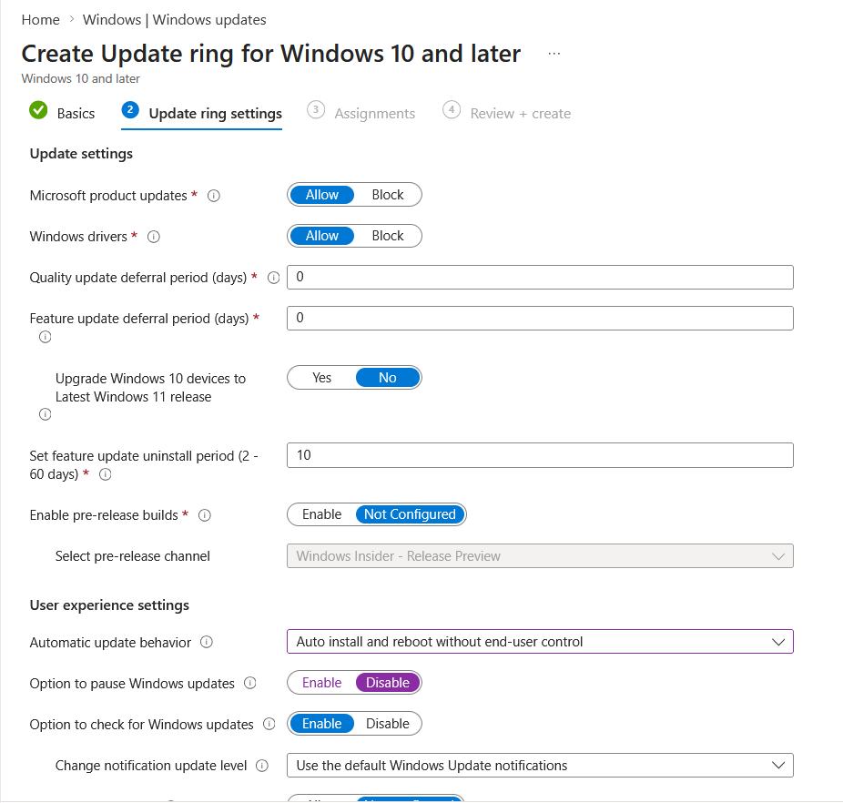
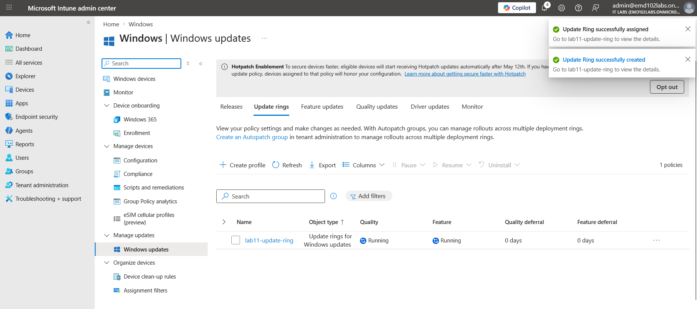

# Lab 11 – Windows Update Ring (Intune)

## Objective

Create and deploy a Windows Update ring policy using Microsoft Intune and verify that the policy is successfully assigned and applied to a Windows 11 device.

---

## Environment

- Device: testlab
- OS: Windows 11
- User: admin@emd102labs.onmicrosoft.com
- Tenant: emd102labs.onmicrosoft.com
- Platform: Microsoft Intune

---

## Step 1 – Create Update Ring

Navigate to:

Devices → Windows → Windows updates → Update rings → Create

### Configuration

- Microsoft product updates: Allow  
- Windows drivers: Allow  
- Quality update deferral: 0 days  
- Feature update deferral: 0 days  
- Upgrade to Windows 11: No  
- Feature uninstall period: 10 days  
- Pre-release builds: Not configured  

### User Experience

- Automatic update behavior: Auto install and reboot without end-user control  
- Pause updates: Disabled  
- Check for updates: Enabled  

### Evidence

---

## Step 2 – Assign Policy

Assign the policy to:

- All Devices

> Important: Update ring policies must be assigned to device groups, not user groups.

---

## Step 3 – Verify Policy in Intune

Navigate to:

Devices → Windows → Windows updates → Update rings

Confirm:

- Policy status: Running  
- Feature updates: Running  
- Quality updates: Running  

### Evidence

---

## Step 4 – Device Check-in

Ensure device sync:

Settings → Accounts → Access work or school → Info → Sync

Verify:

- Device is successfully checked in  
- Status shows **Succeeded**

---

## Step 5 – Validate Policy Application

Validation methods:

- Intune shows **Succeeded**  
- Device is MDM enrolled  
- Windows Update behavior is managed  

> Note: Update ring policies may not always create visible registry keys. Policy application is validated through Intune status and device behavior.

---

## Result

The Windows Update ring policy was successfully deployed and applied to the device. The device is now managed through Intune update policies.

---
