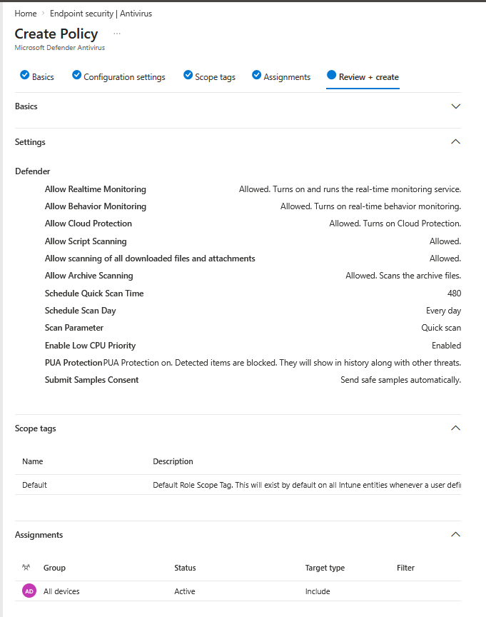
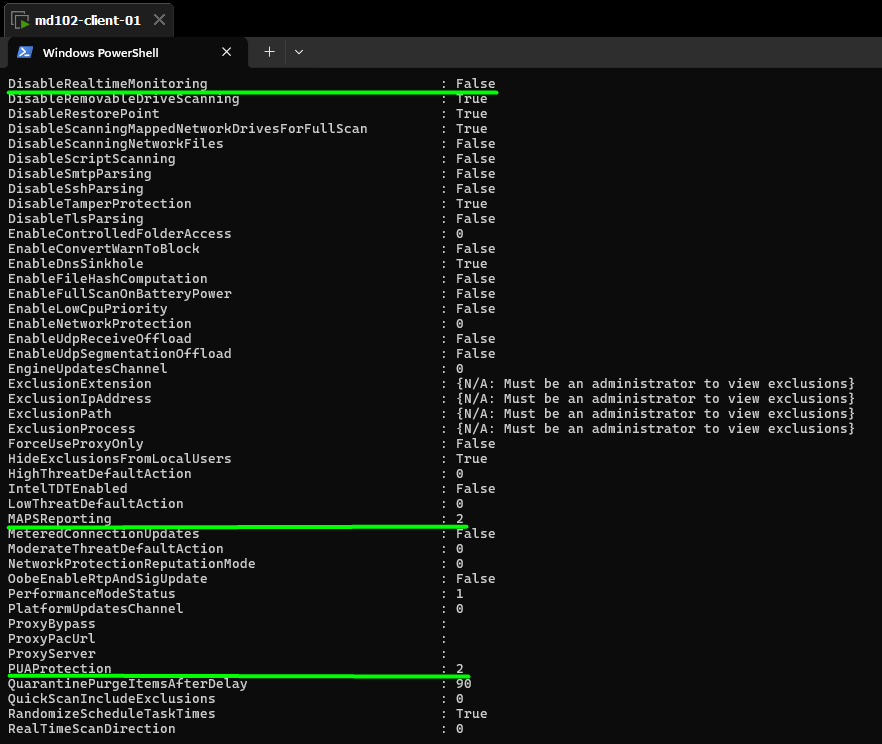
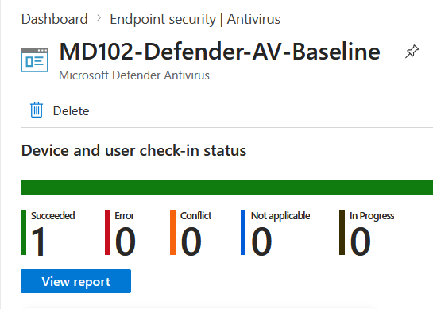

# Lab 12 – Endpoint Security (Microsoft Defender Antivirus via Intune)

## Objective

Deploy and validate a Microsoft Defender Antivirus policy using Microsoft Intune.
Ensure endpoint protection settings are enforced and verified on a Windows 11 device.

---

## Environment

* Device: md102-client-01
* OS: Windows 11
* User: [admin@emd102labs.onmicrosoft.com](mailto:admin@emd102labs.onmicrosoft.com)
* Tenant: emd102labs.onmicrosoft.com
* Platform: Microsoft Intune

---

## Step 1 – Create Antivirus Policy

Navigate to:

```text
Intune Admin Center → Endpoint security → Antivirus → Create Policy
```

Settings:

* Platform: Windows 10 and later
* Profile: Microsoft Defender Antivirus

---

## Step 2 – Configure Policy (Settings Catalog)

The following baseline settings were configured:

### Core Protection

* Allow Realtime Monitoring → Enabled
* Allow Behavior Monitoring → Enabled
* Allow Cloud Protection → Enabled
* Allow Script Scanning → Enabled
* Allow scanning of all downloaded files and attachments → Enabled

### Scan Configuration

* Allow Archive Scanning → Enabled
* Schedule Quick Scan Time → 480 (8 AM)
* Schedule Scan Day → Every day
* Scan Parameter → Quick scan

### Performance

* Enable Low CPU Priority → Enabled

### Security Enhancements

* PUA Protection → Enabled (Block mode)
* Submit Samples Consent → Send safe samples automatically

### Evidence



---

## Step 3 – Assign Policy

Assign to:

* All devices

---

## Step 4 – Sync Device

On the client device:

```text
Settings → Accounts → Access work or school → Info → Sync
```

Optional:

```bash
shutdown /r /t 0
```

---

## Step 5 – Verify via PowerShell

Run:

```powershell
Get-MpPreference
```

### Expected Results

* DisableRealtimeMonitoring → False
* MAPSReporting → 2
* PUAProtection → 2

### Evidence



---

## Step 6 – Validate on Client

Navigate to:

```text
Windows Security → Virus & threat protection settings → Manage Settings
```

Expected:

* Real-time protection enabled
* Cloud protection enabled
* Message: *"This setting is managed by your organization"*

---

## Step 7 – Verify in Intune (Optional)

Navigate to:

```text
Endpoint security → Antivirus → Policy → Device status
```

Note:

* Status may initially show **0 (Not reported)**
* This is due to reporting delay and does not indicate failure



---

## Validation Summary

| Check                   | Result          |
| ----------------------- | --------------- |
| Policy created          | Yes             |
| Assigned to devices     | Yes             |
| Device sync             | Completed       |
| Real-time protection    | Enabled         |
| Cloud protection        | Enabled         |
| PUA protection          | Enabled (Block) |
| PowerShell verification | Successful      |

---

## Result

Microsoft Defender Antivirus policy successfully deployed and enforced via Intune.
All critical security features are active and validated on the client device.

---

## Key Takeaways

* Defender Antivirus can be centrally managed via Intune
* Real-time and cloud protection are essential baseline controls
* PowerShell verification is more reliable than UI
* Intune reporting may be delayed and should not be solely relied upon
* Settings Catalog allows granular security configuration

---

## Common Issues & Lessons Learned

### 1. Wrong Platform Selection

* Selecting **ConfigMgr profile** instead of **MDM** prevents policy deployment

### 2. Reporting Delay

* Intune may show 0 devices even when policy is applied
* Always verify on the client

### 3. Sync Delay

* Policy application may take several minutes
* Manual sync or restart may accelerate enforcement

---

## Conclusion

This lab demonstrates how endpoint protection can be implemented using Microsoft Intune.
It highlights the importance of correct policy configuration, assignment, and validation using multiple methods.
