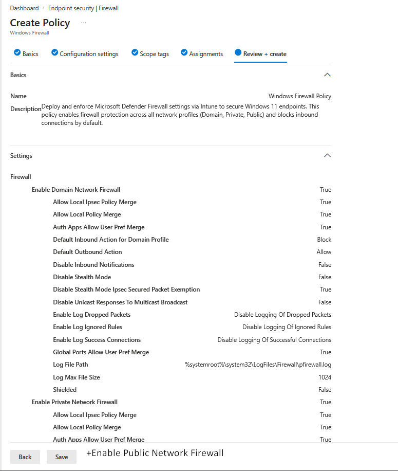
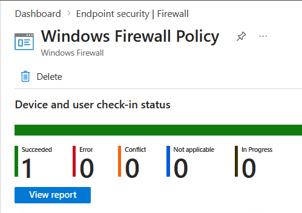
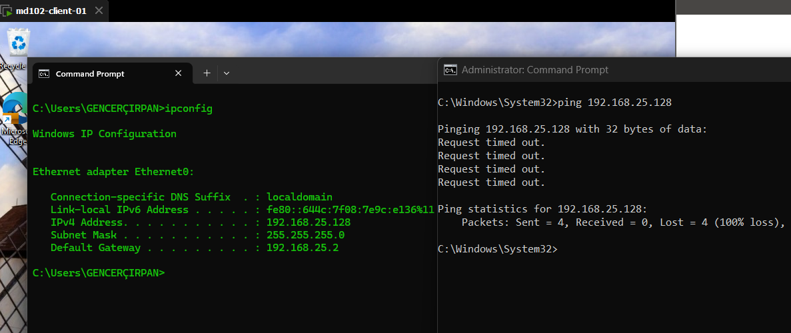

# Lab 13 – Windows Firewall Policy (Intune)

## Objective

Deploy and validate a Microsoft Defender Firewall policy using Microsoft Intune.  
Ensure firewall protection is enabled across all network profiles and confirm that inbound traffic is blocked.

---

## Environment

- Device: md102-client-01  
- OS: Windows 11  
- User: admin@emd102labs.onmicrosoft.com  
- Tenant: emd102labs.onmicrosoft.com  
- Platform: Microsoft Intune  

---

## Step 1 – Create Firewall Policy

Navigate to:

Intune Admin Center → Endpoint security → Firewall → Create Policy

Settings:

- Platform: Windows 10 and later  
- Profile: Microsoft Defender Firewall  

---

## Step 2 – Configure Policy

### Firewall State (All Profiles)

- Enable Domain Network Firewall → True  
- Enable Private Network Firewall → True  
- Enable Public Network Firewall → True  

### Traffic Behavior

- Default Inbound Action → Block  
- Default Outbound Action → Allow  

### Additional Settings

- Disable Stealth Mode → False  
- Disable Inbound Notifications → False

### Notes

- Local policy merge and user preference settings were left as default  
- Logging was not enabled in this configuration  
- Policy deployed using Firewall CSP (MDM-based)

---

## Step 3 – Assign Policy

Assigned to:

All Devices

---

## Step 4 – Sync Device

On the client:

Settings → Accounts → Access work or school → Info → Sync

Optional:

shutdown /r /t 0

---

## Step 5 – Verify Deployment in Intune

Navigate to:

Endpoint security → Firewall → Policy → Device status

Expected:

- Status: Succeeded  

### Evidence

---

## Step 6 – Validate on Client (PowerShell)

Run:

Get-NetFirewallProfile

### Observations

- Firewall profiles are enabled  
- Default actions may appear as `NotConfigured`  
- This is expected due to CSP-based policy behavior  

---

## Step 7 – Real Validation (Traffic Test)

Test inbound traffic:

ping 192.168.25.128

### Expected Result

Request timed out

### Evidence

### Analysis

- Ping uses ICMP (inbound traffic)  
- Firewall blocks inbound connections by default  
- Timeout confirms policy enforcement  

---

## Validation Summary

| Check | Result |
|------|--------|
| Policy created | Yes |
| Assigned to device | Yes |
| Device sync | Completed |
| Firewall enabled | Yes |
| Inbound traffic blocked | Yes |
| Intune status | Succeeded |
| Real-world validation | Successful |

---

## Key Takeaways

- Intune Firewall policies use CSP, not traditional registry-based GPO  
- Registry keys may not always be visible  
- PowerShell may show `NotConfigured` despite enforcement  
- Real traffic testing is the most reliable validation method  
- Default inbound block is a critical security baseline  

---

## Result

The firewall policy was successfully deployed and enforced via Intune.  
Inbound traffic is blocked as expected, confirming correct configuration and endpoint protection.

---

## Conclusion

This lab demonstrates centralized firewall management using Microsoft Intune and highlights the importance of validating policies through actual network behavior rather than relying solely on UI or reporting.
