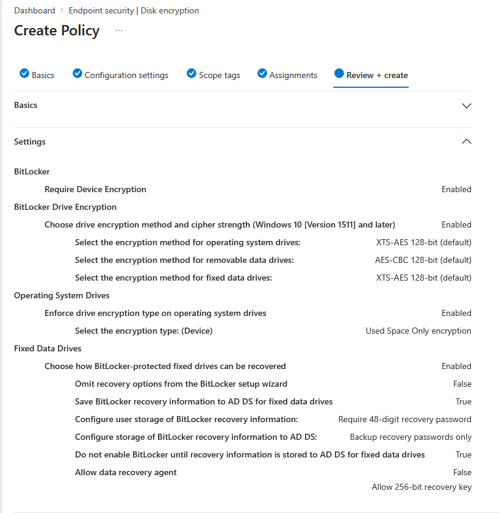
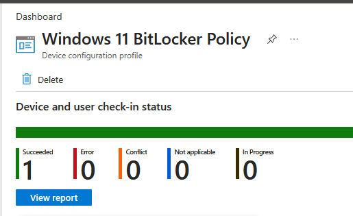
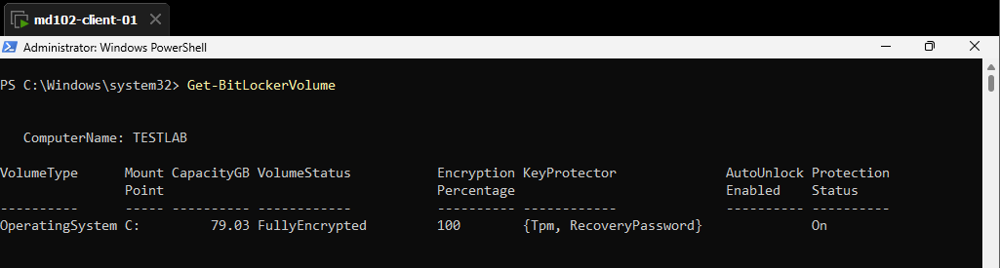
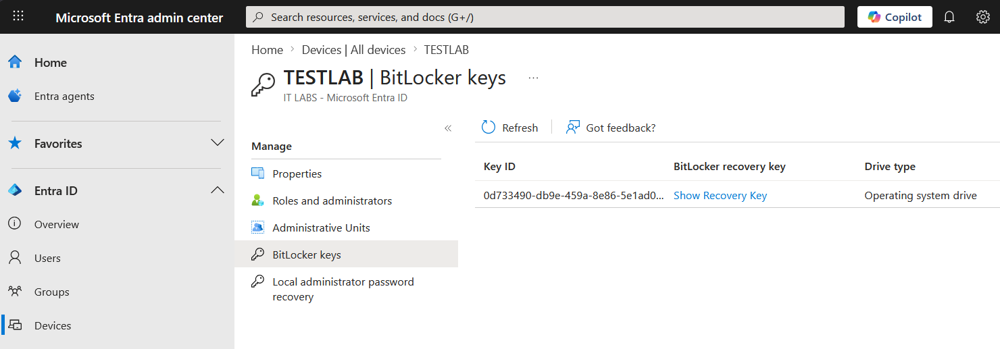

# Lab 14 – BitLocker Disk Encryption Policy (Intune)

## Objective

Deploy BitLocker encryption using Microsoft Intune, enforce encryption on a Windows 11 device, and verify that the recovery key is securely backed up to Microsoft Entra ID.

---

## Environment

* Device: md102-client-01 (TESTLAB)
* OS: Windows 11
* User: [admin@emd102labs.onmicrosoft.com](mailto:admin@emd102labs.onmicrosoft.com)
* Tenant: emd102labs.onmicrosoft.com
* Platform: Microsoft Intune (Endpoint Security)

---

## Step 1 – Create BitLocker Policy

Navigate to:

Devices → Endpoint security → Disk encryption → Create Policy

Configuration:

* Platform: Windows 10 and later
* Profile: BitLocker

---

## Step 2 – Configure Policy Settings

### Encryption

* Require Device Encryption → Enabled
* Encryption method → XTS-AES 128-bit

### Operating System Drive

* Enforce drive encryption type → Enabled
* Encryption type → Used Space Only

### Recovery Configuration

* Require 48-digit recovery password → Enabled
* Backup recovery passwords to Microsoft Entra ID → Enabled
* Do not enable BitLocker until recovery information is stored → Enabled



---

## Step 3 – Assign Policy

Assign to:

* All Devices

---

## Step 4 – Sync Device

On the client:

Settings → Accounts → Access work or school → Info → Sync

Optional restart:

```bash
shutdown /r /t 0
```

---

## Step 5 – Verify Policy Deployment

Navigate to:

Endpoint security → Disk encryption → Policy → Device status

Expected:

* Succeeded: 1
* Error: 0

### Evidence



---

## Step 6 – Validate Encryption (Client)

Run PowerShell:

```powershell
Get-BitLockerVolume
```

Expected:

* VolumeStatus → FullyEncrypted
* EncryptionPercentage → 100
* KeyProtector → {Tpm, RecoveryPassword}

### Evidence



---

## Step 7 – Validate Recovery Key (Entra ID)

Navigate to:

Microsoft Entra Admin Center → Devices → TESTLAB → BitLocker keys

Expected:

* Recovery key present
* Drive type: Operating system drive
* Backup timestamp available

### Evidence



---


## Result

BitLocker encryption successfully deployed and enforced via Microsoft Intune.
The device is fully encrypted, and the recovery key is securely stored in Microsoft Entra ID.

---


---

## Conclusion

This lab demonstrates a complete BitLocker deployment lifecycle using Microsoft Intune, including configuration, enforcement, validation, and recovery key management.
