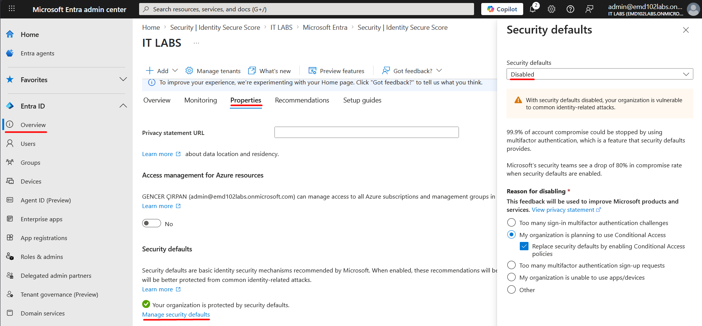
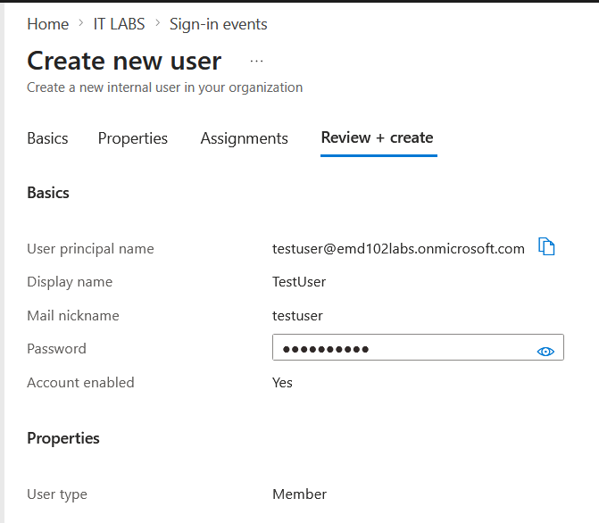
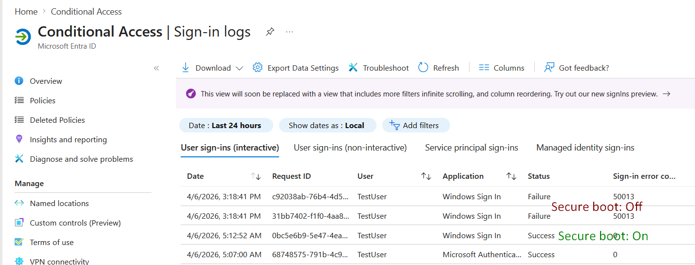

# Lab 15 – Conditional Access (Require Compliant Device)

## Objective

Implement a Conditional Access policy in Microsoft Entra ID that blocks access to cloud resources unless the device is marked as compliant in Microsoft Intune.

---

## Environment

- Device: TESTLAB (Windows 11)
- Platform: Microsoft Intune + Microsoft Entra ID
- User(s):
  - admin@emd102labs.onmicrosoft.com (excluded)
  - testuser@emd102labs.onmicrosoft.com (targeted)

---

## Step 1 – Disable Security Defaults

Security defaults must be disabled to use Conditional Access policies.

- Navigated to:
  - Entra admin Center → Overview → Properties → Manage Security Defaults
- Set:
  - Security defaults → Disabled

---

## Step 2 – Create Conditional Access Policy

Created a policy to enforce device compliance.

### Configuration:

- Name: Require compliant device (LAB)

### Assignments

- Users:
  - Include → All users
  - Exclude → admin user

- Target resources:
  - All cloud apps

- Conditions:
  - Device platform → Windows

### Access Controls

- Grant:
  - Require device to be marked as compliant

### Enable Policy

- Mode: On

---

## Step 3 – Create Test User

A test user was created to validate the policy behavior.

---

## Step 4 – Test Scenarios

### ✅ Scenario 1 – Compliant Device (Secure Boot ON)

- Device meets compliance requirements
- Login is successful

---

### ❌ Scenario 2 – Non-Compliant Device (Secure Boot OFF)

- Secure Boot disabled → device becomes non-compliant
- Conditional Access blocks login

**Result:**
- Sign-in failure
- Error code: 50013 (Conditional Access policy enforced)

---

## Key Findings

- Conditional Access does NOT block Windows login
- It only controls access to cloud resources (Azure, Office, etc.)
- Device compliance is evaluated via Intune
- Secure Boot + BitLocker directly affect compliance status

---

## Conclusion

The Conditional Access policy successfully enforces device compliance by blocking access from non-compliant devices.

This demonstrates how organizations can ensure only secure and compliant endpoints can access corporate resources.
