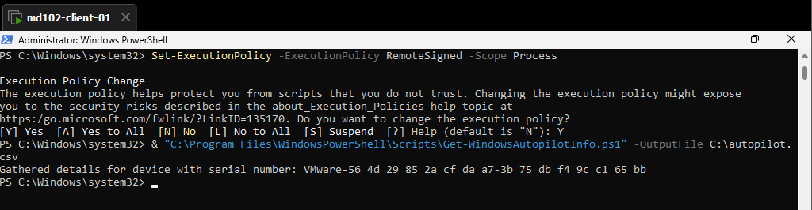
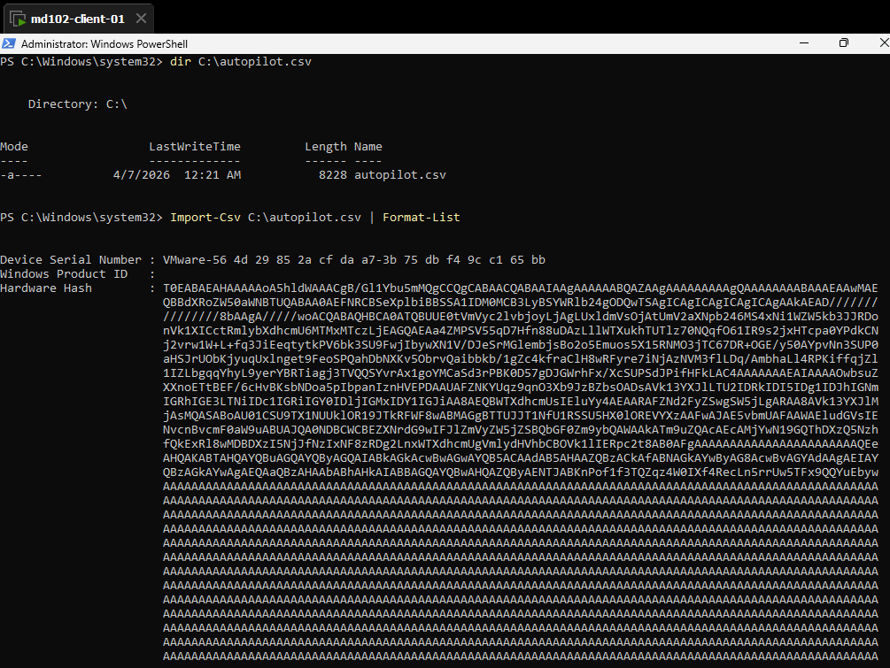
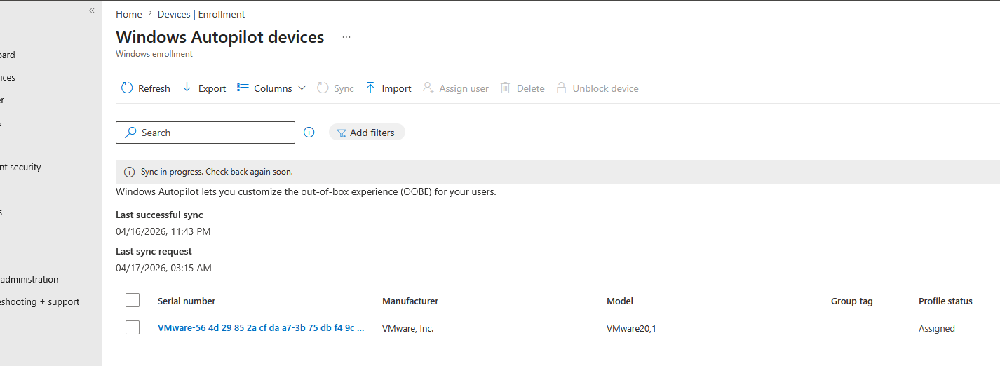
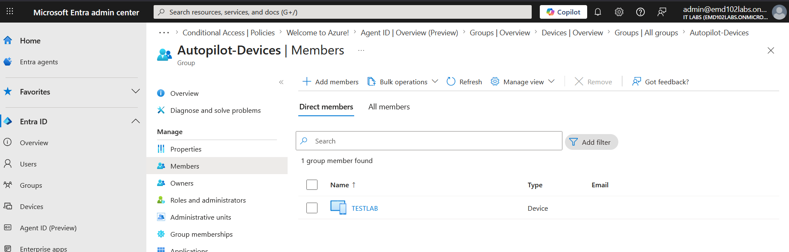
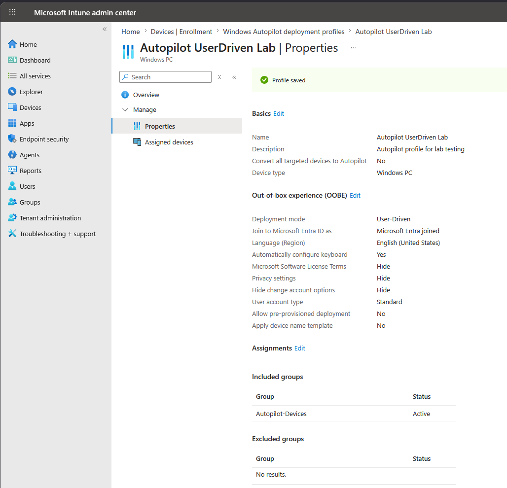

# Lab 16 – Windows Autopilot Deployment (Intune)

## Objective

Configure and validate a complete Windows Autopilot workflow using Microsoft Intune, including device registration, group assignment, and deployment profile configuration.

---

## Environment

- Device: md102-client-01 (TESTLAB)  
- OS: Windows 11  
- User: admin@emd102labs.onmicrosoft.com  
- Tenant: emd102labs.onmicrosoft.com  
- Platform: Microsoft Intune / Microsoft Entra ID  

---

## Step 1 – Collect Hardware Hash

Open PowerShell as Administrator and run:

```powershell
Set-ExecutionPolicy -ExecutionPolicy RemoteSigned -Scope Process
Install-Script -Name Get-WindowsAutopilotInfo -Force
Get-WindowsAutopilotInfo.ps1 -OutputFile C:\autopilot.csv
```

Verify the output:

```powershell
Import-Csv C:\autopilot.csv | Format-List
```

### Evidence

  


---

## Step 2 – Import Device into Autopilot

Navigate to:

Devices → Enrollment → Windows → Windows Autopilot devices  

- Click **Import**  
- Upload `autopilot.csv`  
- Wait for sync  

### Evidence



---

## Step 3 – Create Device Group

Navigate to:

Microsoft Entra ID → Groups → New group  

Configuration:

- Group type: Security  
- Group name: Autopilot-Devices  
- Membership type: Assigned  

Add member:

- TESTLAB (Device)  

### Evidence



---

## Step 4 – Create Autopilot Deployment Profile

Navigate to:

Devices → Enrollment → Deployment profiles → Create profile  

Configuration:

- Deployment mode: User-Driven  
- Join type: Microsoft Entra ID joined  
- User account type: Standard  
- Privacy settings: Hide  
- License terms: Hide  

---

## Step 5 – Assign Deployment Profile

Assign profile to:

- Autopilot-Devices (device group)  

### Evidence



---

## Step 6 – Validate Assignment

Navigate to:

Devices → Enrollment → Windows Autopilot devices  

Verify:

- Device is listed  
- Profile status: **Assigned**  

### Evidence


---

## Result

- Device successfully registered in Windows Autopilot  
- Deployment profile assigned via group  
- Device ready for Autopilot provisioning  

---

## Notes

- Hardware hash is required for Autopilot onboarding  
- Group-based assignment is recommended over "All devices"  
- Profile assignment may take a few minutes
