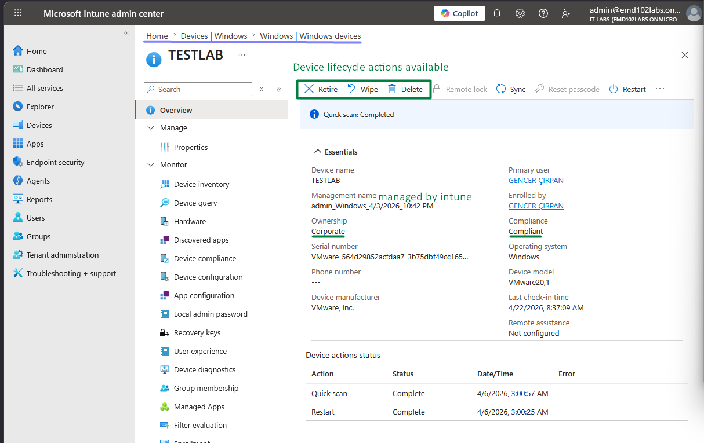
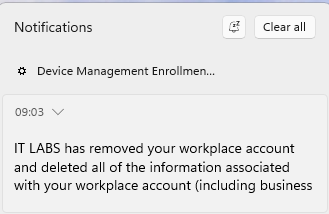
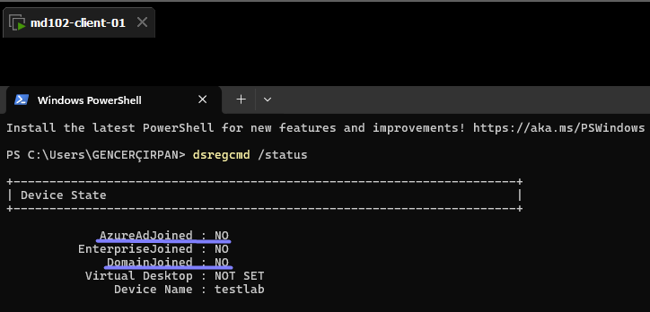

# Lab 17 – Device Lifecycle Management (Retire / Wipe / Delete via Intune)

## Objective

Manage the lifecycle of a Windows 11 device using Microsoft Intune by performing retire, wipe, and delete actions.  
Validate lifecycle behavior using both the Intune portal and client-side checks.

---

## Environment

- Device: md102-client-01 (TESTLAB)  
- OS: Windows 11  
- User: admin@emd102labs.onmicrosoft.com  
- Tenant: emd102labs.onmicrosoft.com  
- Platform: Microsoft Intune  

---

## Step 1 – Verify Initial Device State

Navigate to:

Intune Admin Center → Devices → Windows → Windows devices

Select:

- TESTLAB

### Expected Result

- Device is **Managed**  
- Compliance status is **Compliant**  
- Lifecycle actions available: **Retire / Wipe / Delete**

### Evidence

---

## Step 2 – Retire Device

Navigate:

Device → Overview → Retire

Confirm action.

### Expected Result

- Device is removed from Intune management  
- Work account is removed from the device  
- Corporate data is deleted  
- Personal data remains intact  

---

## Step 3 – Validate Retire (Client)

After executing the retire action:

- System notification confirms removal of workplace account  
- Device is no longer managed by Intune  

### Evidence

---

## Step 4 – Technical Validation

Run:

dsregcmd /status

### Expected Result

- AzureAdJoined: **NO**  
- EnterpriseJoined: **NO**  
- DomainJoined: **NO**

This confirms that the device is no longer enrolled.

### Evidence

---

## Step 5 – Wipe Device (Simulated)

The wipe action was intentionally not executed to avoid rebuilding the lab environment.

### Expected Result

- Device resets to factory state  
- Windows returns to OOBE (Out-of-Box Experience)  
- All data is removed  

### Validation Method

- Device would display Windows setup screen  
- Intune would report wipe status  

---

## Step 6 – Delete Device (Conceptual)

After wipe, the device record can be removed from Intune.

### Expected Result

- Device is removed from Intune inventory  

---

## Validation Summary

| Action | Result |
|------|--------|
| Retire | Successfully removed management |
| Client validation | Work account removed |
| dsregcmd | Device no longer joined |
| Wipe | Simulated |
| Delete | Conceptual |

---

## Key Differences

| Action | Data Removed | Device Reset | Intune Record |
|-------|-------------|-------------|--------------|
| Retire | Corporate only | No | Remains |
| Wipe | All data | Yes | Remains |
| Delete | None (portal only) | No | Removed |

---

## Key Takeaways

- Retire removes corporate access without affecting personal data  
- Wipe fully resets the device for reuse  
- Delete removes stale records from Intune  
- Validation should include both UI and command-line checks  

---

## Conclusion

This lab demonstrates how Microsoft Intune can manage the full lifecycle of a device, from active management to secure decommissioning.
