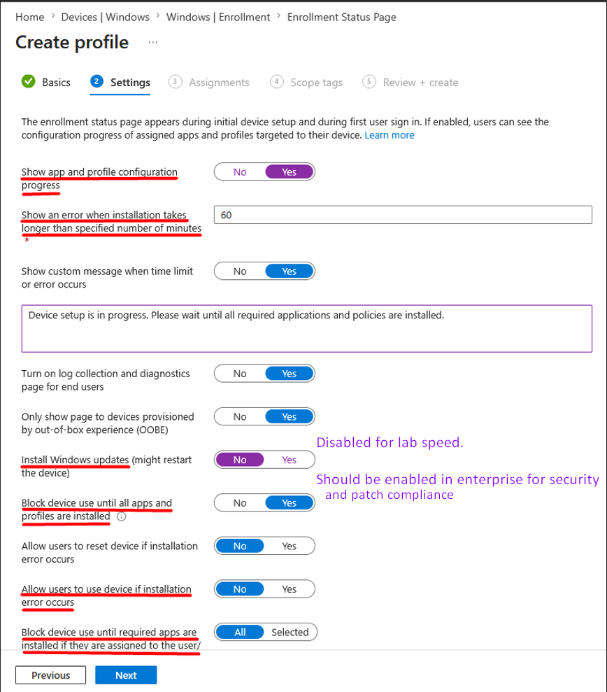
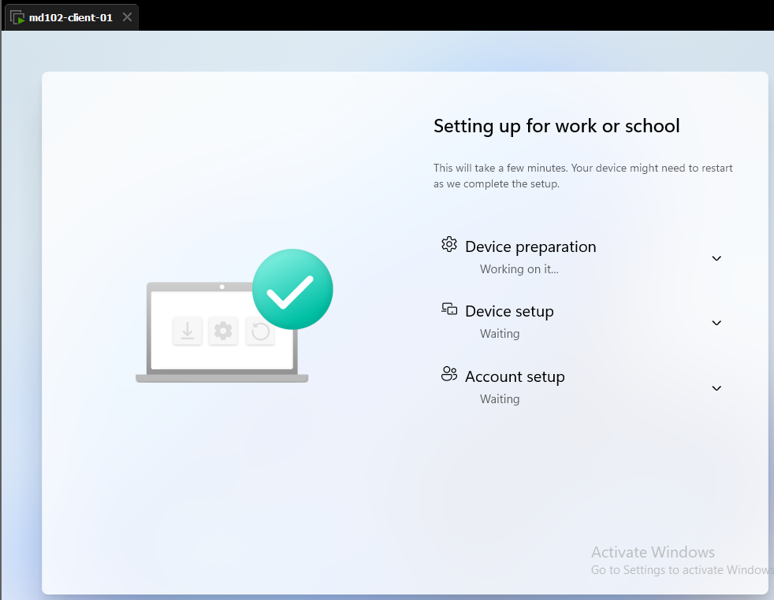
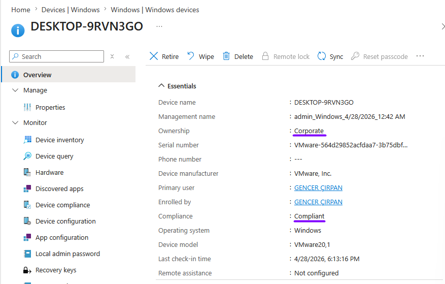

# Lab 18 – Enrollment Status Page (ESP) with Autopilot

## Objective

Configure and validate the Enrollment Status Page (ESP) in Microsoft Intune to control the device provisioning experience during Windows Autopilot.

Ensure that required applications and policies are installed before the user can access the desktop.

---

## Environment

* Device: md102-client-01 (TESTLAB)
* OS: Windows 11
* User: [admin@emd102labs.onmicrosoft.com](mailto:admin@emd102labs.onmicrosoft.com)
* Tenant: emd102labs.onmicrosoft.com
* Platform: Microsoft Intune / Windows Autopilot

---

## Prerequisites

* Device registered in Windows Autopilot (Lab 16)
* Device group assigned (Autopilot-Devices)
* At least one Win32 app available (Lab 10 – 7-Zip)

---

## Step 1 – Create Enrollment Status Page (ESP)

Navigate to:

Intune Admin Center → Devices → Windows → Enrollment → Enrollment Status Page

Click: Create

### Configuration

#### Device settings

* Show app and profile installation progress → Yes
* Show an error when installation takes longer than specified number of minutes → Yes
* Timeout (minutes) → 60
* Install Windows updates → No
* Allow users to use device if installation error occurs → No

#### Block device use

* Block device use until all apps and profiles are installed → Yes
* Block device use until required apps are installed → All

#### Allow log collection

* Allow users to collect logs → Yes

### Evidence

---

## Step 2 – Assign ESP Profile

Assign to:

Autopilot-Devices

> Important: ESP must be assigned to the same group used for Autopilot deployment.

---

## Step 3 – Configure Required Application

Navigate to:

Intune Admin Center → Apps → Windows → 7zip

Edit assignment:

Required → Autopilot-Devices

### Validation Goal

* App must install during ESP phase
* User must NOT reach desktop before installation completes

---

## Step 4 – Trigger Autopilot Flow

Reset device:

Settings → System → Recovery → Reset this PC

Select:

* Remove everything

This triggers OOBE and starts the Autopilot provisioning flow.

---

## Step 5 – Observe Enrollment Status Page

During setup, observe:

"Setting up for work or school"

### Expected Behavior

* Device is blocked at ESP screen

* Progress shows:

  * Device preparation
  * Device setup
  * Account setup

* Required applications install before desktop access

### Evidence

---

## Step 6 – Validate Application Installation

After ESP completes:

Check:

C:\Program Files\7-Zip

or run:

Get-ChildItem "C:\Program Files\7-Zip"

### Expected Result

* 7-Zip installed
* No manual user interaction required

---

## Step 7 – Verify in Intune

Navigate to:

Devices → Windows → Windows devices → TESTLAB

Check:

* Ownership → Corporate
* Device status → Managed
* Compliance → Compliant
* Last check-in successful

### Evidence

---

## Validation Summary

| Check                                | Result     |
| ------------------------------------ | ---------- |
| ESP profile created                  | Yes        |
| ESP assigned                         | Yes        |
| Required app assigned                | Yes        |
| Autopilot flow triggered             | Yes        |
| ESP blocking behavior                | Successful |
| App installed during ESP             | Yes        |
| Desktop access blocked until install | Yes        |
| Compliance status                    | Compliant  |

---

## Result

Enrollment Status Page (ESP) was successfully configured and validated.

The device was blocked during Autopilot provisioning until required applications and policies were applied.

Final compliance status confirmed successful enrollment and secure device onboarding.

---

## Key Takeaways

* ESP controls device access before desktop availability
* Required apps can block user access until installation completes
* Correct group assignment is critical for successful ESP enforcement
* Compliance status is the strongest final validation

## Important Note

ESP does not enable BitLocker.

BitLocker is enforced by the Compliance and BitLocker policy.

If BitLocker is not fully enabled, the device appears as Non-compliant in Intune.

