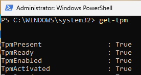
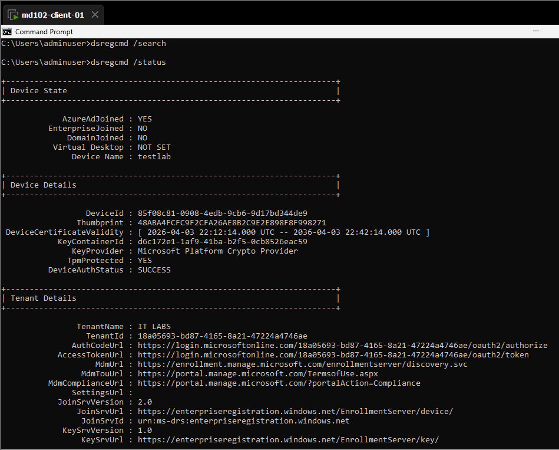
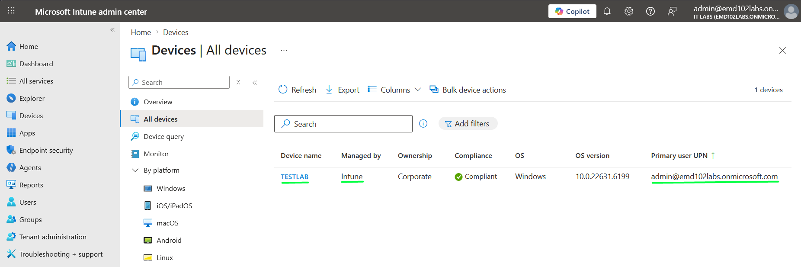
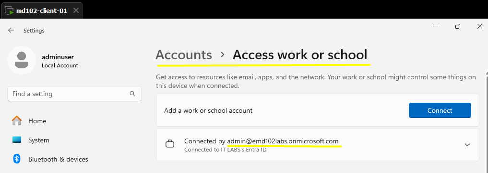
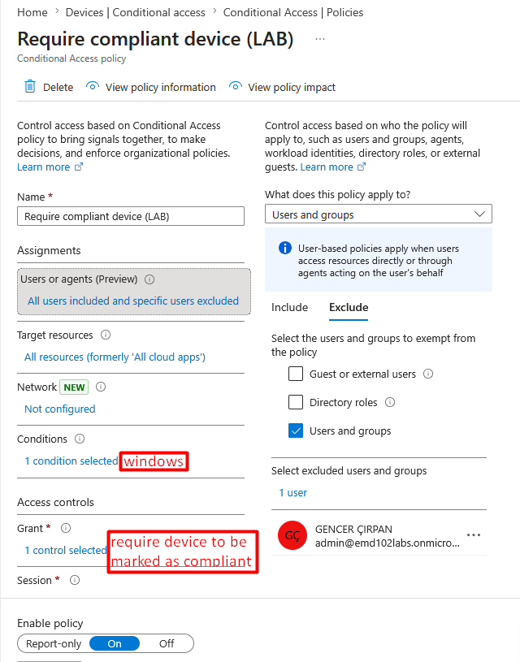

# Final Project – Enterprise Windows 11 Endpoint Management with Microsoft Intune and Microsoft Entra ID

## Objective

Design, deploy, and validate a complete enterprise-grade Windows 11 endpoint management lifecycle using Microsoft Intune and Microsoft Entra ID.

This project simulates how an organization provisions, secures, manages, and controls access to corporate devices from initial enrollment to secure decommissioning.


---

# Environment

* Device: md102-client-01 (TESTLAB)
* OS: Windows 11 Enterprise
* Hypervisor: VMware Workstation
* Tenant: emd102labs.onmicrosoft.com
* Platform: Microsoft Intune + Microsoft Entra ID
* Primary User: [admin@emd102labs.onmicrosoft.com](mailto:admin@emd102labs.onmicrosoft.com)

---

# Project Scope

* Microsoft Entra ID Join
* Automatic Intune MDM Enrollment
* Windows Autopilot Registration
* Enrollment Status Page (ESP)
* Configuration Profiles
* Compliance Policies
* Windows Update Rings
* Win32 Application Deployment
* Microsoft Defender Antivirus
* Microsoft Defender Firewall
* BitLocker Encryption
* Conditional Access
* Device Lifecycle Management

---

# Phase 1 – Device Provisioning

---

## Step 1 – Prepare Windows 11 Environment

Validated:

* TPM enabled
* UEFI enabled
* Windows 11 installed
* Local administrator created
* Device renamed correctly

Verification:

```powershell
Get-Tpm
hostname
whoami
dsregcmd /status
```

### Evidence





---

## Step 2 – Microsoft Entra ID Join

Navigate:

```text
Settings → Accounts → Access work or school → Connect
```

Select:

```text
Join this device to Microsoft Entra ID
```

Verification:

```powershell
dsregcmd /status
```

Expected:

- AzureAdJoined : YES
- DeviceAuthStatus : SUCCESS

### Evidence


---

## Step 3 – Intune Automatic Enrollment

After Microsoft Entra ID join, the device was automatically enrolled into Microsoft Intune through MDM auto-enrollment.

Validation:

- Device appears in Intune
- Managed by: Intune
- Ownership: Corporate
- Compliance status visible

### Evidence







---


## Step 4 – Windows Autopilot Registration

The device was registered in Windows Autopilot by collecting and uploading the hardware hash.

Collect hardware hash:

```powershell
Get-WindowsAutopilotInfo.ps1 -OutputFile C:\autopilot.csv
```

Verify CSV output:

```powershell
Import-Csv C:\autopilot.csv | Format-List
```

Upload location:

```text
Devices → Enrollment → Windows Autopilot devices
```

Expected:

- Device imported successfully
- Deployment profile assigned successfully
- Join type set to Microsoft Entra joined
- User-driven deployment configured

### Evidence


---

## Step 5 – Enrollment Status Page (ESP)

Configured:

- Device blocked until required apps installed
- Installation progress visible
- Desktop access restricted before provisioning completion

### Evidence


---

# Phase 2 – Configuration Management

---

## Step 6 – Disable Control Panel

Configuration profile:

```text
Administrative Templates → Control Panel
```

Enabled:

```text
Prohibit access to Control Panel and PC settings
```

Validation:

```cmd
control.exe
```

Expected:

Access to Control Panel and PC settings is blocked.

### Evidence


---

## Step 7 – Win32 App Deployment (7-Zip)

Deployment:

- .intunewin packaging
- Silent installation
- Detection rule configured
- Assigned to all devices

### Evidence


---

## Step 8 – Windows Update Ring

Configured:

- Automatic update installation
- Automatic reboot after updates
- No end-user control over update behavior

### Evidence


---

# Phase 3 – Security Baseline

---

## Step 9 – Compliance Policy

Enforced:

* TPM required
* Secure Boot required
* BitLocker required
* Minimum OS version enforced

Expected:

Device must be reported as Compliant in Microsoft Intune.

### Evidence


---

## Step 10 – Microsoft Defender Antivirus

Configured:

* Realtime protection
* Cloud protection
* Script scanning
* PUA protection

Validation:

```powershell
Get-MpPreference
```

### Evidence


---

## Step 11 – Microsoft Defender Firewall

Configured:

- All firewall profiles enabled
- Default inbound action = Block
- Default outbound action = Allow

Configuration verification:

```powershell
Get-NetFirewallProfile
```

Enforcement validation:

```cmd
ping target-ip
```

Expected:

Inbound ICMP traffic is blocked by firewall policy.

### Evidence


---

## Step 12 – BitLocker Encryption

Configured:

* Device encryption required
* Recovery key backup to Entra ID
* TPM-based protection with Recovery Password

Validation:

```powershell
Get-BitLockerVolume
```

Expected:

- Operating system drive status = FullyEncrypted
- BitLocker recovery key is backed up to Microsoft Entra ID

### Evidence


---

# Phase 4 – Secure Access Control

---

## Step 13 – Conditional Access

Created policy:

```text
Require device to be marked as compliant
```

Target:

* Windows devices
* All cloud apps

Validation:

### Compliant Device

Expected:

Access granted

### Non-Compliant Device

Expected:

Access blocked

Error:

```text
50013
```

### Evidence





---

# Phase 5 – Device Lifecycle Management

---

## Step 14 – Retire Device

Executed:

```text
Device → Retire
```

Expected:

* Work account removed
* Corporate data removed
* Device unmanaged

Validation:

```powershell
dsregcmd /status
```

Expected:

* AzureAdJoined : NO
* Workplace account removed
* Device no longer managed by Intune

### Evidence


---

## Step 15 – Wipe + Delete (Conceptual)

Expected:

* Full factory reset
* OOBE restart
* Device removed from Intune inventory

This step was documented conceptually as executing it would reset the lab environment.

---

# Validation Methods

Validation was performed using:

* Microsoft Intune Admin Center
* Microsoft Entra Admin Center
* PowerShell verification
* dsregcmd
* Registry checks
* Real endpoint behavior testing
* Windows Settings verification
Validation was not based solely on portal status.

---

# Key Lessons Learned

* Intune reporting can be delayed
* Real endpoint validation is critical
* Compliance directly drives Conditional Access
* BitLocker recovery validation is mandatory
* Detection rules define Win32 app success
* Autopilot depends heavily on correct group assignment
* ESP is one of the strongest provisioning validations

---

# Result

A complete enterprise Windows 11 endpoint lifecycle was successfully designed, deployed, validated, and documented.

The device moved through:

Provisioning → Enrollment → Configuration → Security → Access Control → Lifecycle

using Microsoft Intune and Microsoft Entra ID.

This project demonstrates practical endpoint administration skills aligned with real-world enterprise device management and MD-102 certification objectives.

---

# Final Conclusion

This was not a collection of isolated labs.

This project represents a complete enterprise endpoint management implementation using Microsoft’s modern management stack.

It demonstrates the ability to deploy secure, compliant, manageable, and policy-enforced corporate Windows devices at production level.
